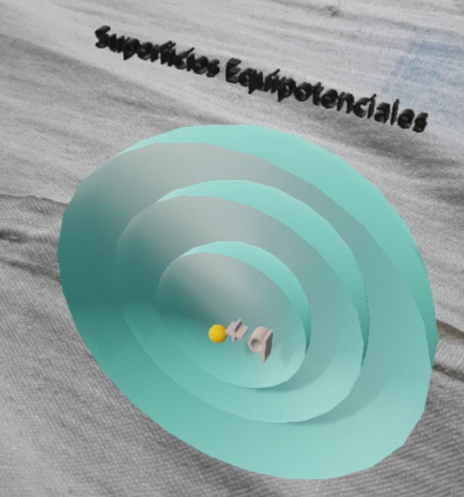

# EquipotentialX ⚛️


## Table of Contents 📚

1. [Description](#description)
2. [Installation](#installation)
3. [Usage](#usage)
4. [Contribution](#contribution)
5. [Troubleshooting](#troubleshooting)
6. [License](#license)

## Description 🖋️

EquipotentialX is an Android application developed with Kotlin, ARCore, and Ktor. It allows users to visualize the electric field and equipotential curves of two electric charges in Augmented Reality (AR). This application is a great tool for understanding and visualizing complex concepts in physics.

<div style="display: flex; justify-content: start; width: 100%;">
  
  
</div>

## Installation 💻

To run this application, you will need to have Android Studio installed on your machine. Here are the steps to install it:

1. Download and install Android Studio from [here](https://developer.android.com/studio).
2. Clone this repository on your local machine using `git clone https://github.com/16george/EquipotentialX.git`.

## Usage 🕹️

To run the application, follow these steps:

1. Open Android Studio.
2. Click on "File" -> "Open".
3. Navigate to the directory of the cloned repository and click on "Open".
4. Once the project is open, click on "Run" -> "Run 'app'".

## Contribution 🤝

Contributions are always welcome. To contribute:

1. Fork the project.
2. Create your Feature Branch (`git checkout -b feature/AmazingFeature`).
3. Commit your changes (`git commit -m 'Add some AmazingFeature'`).
4. Push to the Branch (`git push origin feature/AmazingFeature`).
5. Open a Pull Request.

## Troubleshooting 🔧

If you encounter any problems while setting up or running the application, please check the [Issues](https://github.com/16george/EquipotentialX/issues) section of this repository to see if your issue has already been addressed. If not, feel free to open a new issue with a description of the problem you're experiencing.

## License 📄
```
MIT License

Copyright (c) 2021 George Namoc

Permission is hereby granted, free of charge, to any person obtaining a copy
of this software and associated documentation files (the "Software"), to deal
in the Software without restriction, including without limitation the rights
to use, copy, modify, merge, publish, distribute, sublicense, and/or sell
copies of the Software, and to permit persons to whom the Software is
furnished to do so, subject to the following conditions:

The above copyright notice and this permission notice shall be included in all
copies or substantial portions of the Software.

THE SOFTWARE IS PROVIDED "AS IS", WITHOUT WARRANTY OF ANY KIND, EXPRESS OR
IMPLIED, INCLUDING BUT NOT LIMITED TO THE WARRANTIES OF MERCHANTABILITY,
FITNESS FOR A PARTICULAR PURPOSE AND NONINFRINGEMENT. IN NO EVENT SHALL THE
AUTHORS OR COPYRIGHT HOLDERS BE LIABLE FOR ANY CLAIM, DAMAGES OR OTHER
LIABILITY, WHETHER IN AN ACTION OF CONTRACT, TORT OR OTHERWISE, ARISING FROM,
OUT OF OR IN CONNECTION WITH THE SOFTWARE OR THE USE OR OTHER DEALINGS IN THE
SOFTWARE.
```

